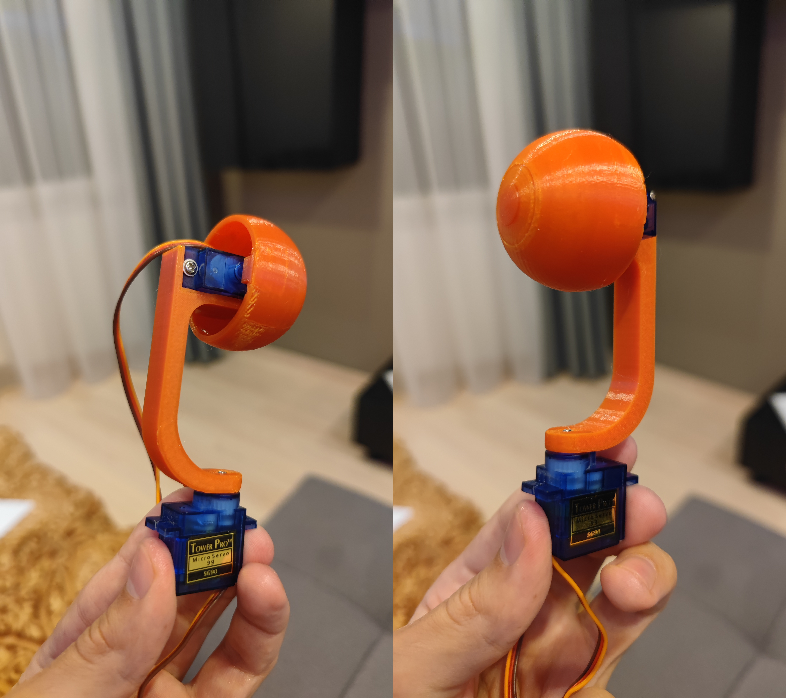
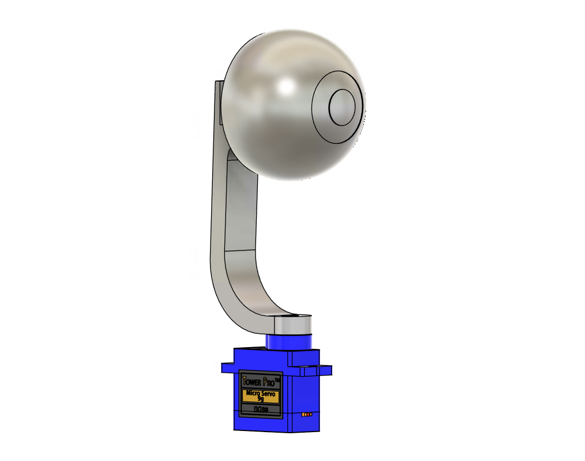
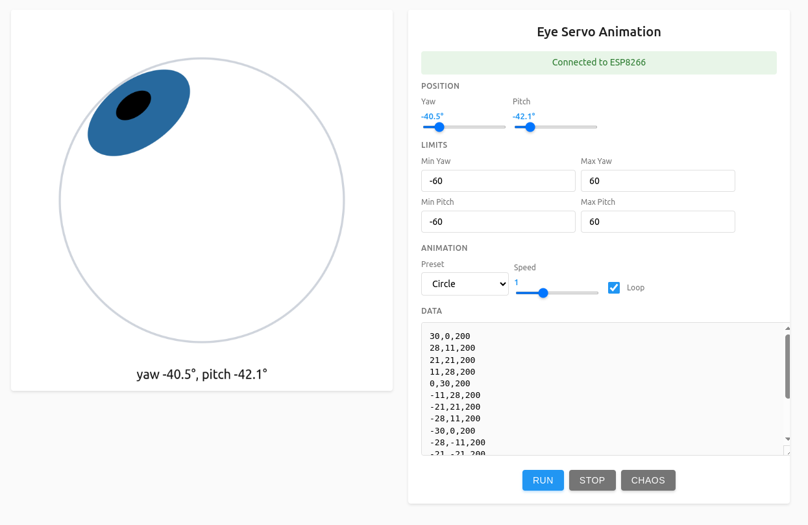

# Eye Controller — ESP8266 Web‑Controlled Dual Servo

Control two hobby servos (yaw and pitch) from a responsive web UI hosted directly on an ESP8266 (Wemos D1 Mini). The firmware embeds the UI, exposes a small HTTP API, and persists settings so the device comes back exactly as you left it after power cycles.

## Contents
- [Overview](#overview)
- [Features](#features)
- [Hardware](#hardware)
- [Quickstart](#quickstart)
- [Build and flash](#build-and-flash)
- [Web UI](#web-ui)
- [HTTP API](#http-api)
- [Servo setup and calibration](#servo-setup-and-calibration)
- [Create custom animations](#create-custom-animations)
- [Troubleshooting](#troubleshooting)
- [Technical details](#technical-details)
- [Build system (HTML → C++)](#build-system-html--c)
- [Project structure](#project-structure)
- [License](#license)
- [Support](#support)

## Overview
Eye Controller turns an ESP8266 into a self‑contained access point with a built‑in web interface to position two servos and play simple animations. It is ideal for animatronics like an eyeball that can look around with smooth motion.

<p align="center">
  
  <br/>
  <em>Real build of the Eye Controller in action</em>
  
</p>

## Features
- Wi‑Fi access point with a built‑in, responsive web UI
- Real‑time control for yaw and pitch
- Preset animations with adjustable speed and looping
- Settings saved to EEPROM and restored on boot
- HTML UI embedded directly in firmware (no external files required)
- Automatic HTML → C++ compilation during build

## Hardware
Target: ESP8266 (Wemos D1 Mini) + two 5V hobby servos (e.g., SG90).

<p align="center">
  
  <br/>
  <em>Fusion 360 model of the mechanical assembly</em>
</p>

Default connections:

```
ESP8266 (Wemos D1 Mini)    →    Servo
D1 (GPIO5)                  →    Yaw Servo signal
D2 (GPIO4)                  →    Pitch Servo signal
5V                          →    Servo power (+)
GND                         →    Shared ground
```

Recommendations:
- Power servos from a dedicated 5V source (≥2A) and tie GND with ESP8266
- Do not power servos from 3.3V pins
- Alternative pins are possible; see `ServoController.h`.

### Alternative pins
If D1 and D2 are occupied, update constants in `ServoController.h`:

```cpp
static const int YAW_PIN = D5;    // GPIO14
static const int PITCH_PIN = D6;  // GPIO12
```

Other usable pins: D5 (GPIO14), D6 (GPIO12), D7 (GPIO13). Avoid D8 (GPIO15) because it is pulled low at boot.

## Quickstart
Steps:
1) Wire two servos to D1 (yaw) and D2 (pitch), provide proper 5V power
2) Build and flash (PlatformIO):

```bash
pio run --target upload
```

3) Connect to Wi‑Fi AP: SSID `EyeController`, password `12345678`
4) Open the UI at `http://192.168.4.1` or `http://eye.local`

## Build and flash
Prerequisites:
- PlatformIO in VS Code (recommended)
- ESP8266 (Wemos D1 Mini)

Commands:

```bash
# Build and upload
pio run --target upload

# Optional: serial monitor
pio device monitor
```

The build integrates a pre‑step that compiles HTML from `web/` into C++ headers in `src/`.

## Web UI
The web UI offers:
- Canvas controller for intuitive look control with the mouse
- Yaw/Pitch sliders for precise positioning
- Preset animations with speed and loop options
- Built‑in CSV editor for custom animation sequences

<p align="center">
  
  <br/>
  <em>Web UI with canvas control, sliders, presets, and CSV editor</em>
</p>

## HTTP API
Base URL is the device root (`/`). All endpoints are plain HTTP.

### GET /api/position
Returns the current position and animation state.

```json
{
  "yaw": 0.0,
  "pitch": 0.0,
  "animationRunning": false,
  "currentPreset": "Center Sweep",
  "speed": 1.0,
  "loop": true
}
```

### POST /api/position
Set target servo position (degrees).

```
yaw=15.5&pitch=-10.0
```

### POST /api/animation
Start/stop animations. When starting, provide CSV data (see below).

```
action=start&data=-60,0,600\n-30,0,600\n0,0,600
action=stop
```

### POST /api/settings
Persist settings.

```
preset=Figure Eight&speed=1.5&loop=true
```

### GET /api/settings
Read saved settings.

## Servo setup and calibration
1) Move both servos to their neutral (center) position
2) Adjust horn/arm mounting to achieve the desired mechanical range
3) Use UI limits to keep motion within safe bounds

Recommended starting ranges:
- Yaw: −60° … +60°
- Pitch: −60° … +60°
- Animation speed: 0.5 … 2.0
- Typical servo: SG90 (180°)

## Create custom animations
Animations are defined in CSV as triples of `yaw,pitch,duration_ms` per line.

```
yaw,pitch,duration
-60,0,600
-30,0,600
0,0,600
30,0,600
60,0,600
0,0,600
```

Upload the CSV in the UI or send it with `/api/animation` when `action=start`.

## Troubleshooting
Servos do not move:
- Verify 5V power to servos
- Check signal wires on D1/D2
- Confirm UI limits are not restricting movement

Cannot connect to Wi‑Fi:
- Look for AP `EyeController` (password `12345678`)
- Connect directly to `192.168.4.1` if mDNS is unavailable

UI does not load:
- Clear browser cache or try another browser
- Ensure you are connected to the device AP

## Technical details
Libraries:
- ESPAsyncWebServer (HTTP server)
- ArduinoJson (JSON processing)
- Servo (servo control)
- ESP8266mDNS (mDNS `.local` support)

Resource usage (typical):
- Flash: ~400 KB
- RAM: ~30 KB
- EEPROM: ~512 bytes for settings

Performance (typical):
- Servo update rate: ~50 Hz
- UI latency: <100 ms
- Up to ~50 animation frames

## Build system (HTML → C++)
During `pio run` the HTML from `web/` is converted to a C++ header (e.g., `src/ui_html.h`) via the tools in `tools/`. The firmware then serves the embedded HTML and decodes it at runtime.

## Project structure
```
firmware/
├── web/                    HTML sources (UI)
├── tools/                  Build tools (HTML → C++)
├── src/                    Firmware sources (C++)
│   └── ui_html.h           Auto‑generated header
├── platformio.ini          PlatformIO configuration
└── *.md                    Documentation
```

## License
MIT License — free for personal and commercial use.

## Support
If you run into issues:
1) Check hardware connections and power
2) Verify settings and serial logs (`pio device monitor`)
3) Open an issue in the repository with details


